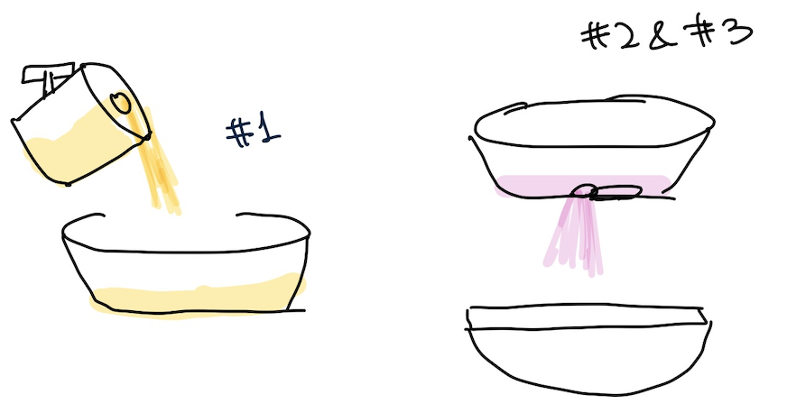

# Imaginary Mechanism for Clock
The objective of this assignment was to ideate an imaginary mechanism for a clock, inspired by in-class readings, exercises, and presentations.

### Sand Art Clock

Sand art clocks are clock mechanisms that pour sand from one bucket to another at specific times: every quarter, half, and full hour. This ultimately creates a layered sand art. This project was inspired by the sand art I saw at a souq, where a sand artist would pour in colored sand in layers to create beautiful sand art in a bottle.

### Inspiration 

This project was inspired by layered sand art, which creates a beautiful bottle by layering different colored sand.

### How it works?
1) Every 15 minutes (at 15, 30, 45, and 60 minutes), one of the four sand buckets in the third row turns 180 degrees and pours sand into the 30-minute bucket in the second row for 30 seconds. The bucket is fitted with a cap with a hole, so the sand is released gradually. The colors are poured in order every quarter hour; for example, for the image above, yellow, then pink, orange and finally green.

2) Every 30 minutes, the slit that covers the hole in the bottom of the bucket in row 2 moves its direction, uncovering the hole and allowing the sand to pour out into the bucket in row 1. This means that, when the 15 and 30 minute intervals overlap, the mechanisms for bucket from row 3 pouring into bucket 5, and for sand from bucket 5 pouring into bucket 7, can occur concurrently.

3) Every full hour, the slit that covers the hole in the bottom of bucket 7 moves, uncovering the hole and allowing sand to pour out into the acrylic box. This way, the sand is gradually layered in the acrylic box until the sand in the source, row 3, runs out.

### Extension & Questions
I am exploring options to make this mechanism run infinitely, rather than having to stop when the sand on the top layers run out. Like water fountain mechanic, if I can bring the layered sand back to the source sand bottles, It can run infinitely. However, there are some challenges such as:

1) Sand color can get mixed up and it won't be able to make distinguished 

### Resources
How to build **rotate and spill** mechanism [youtube video](https://www.youtube.com/watch?v=s8uNwQK8ew0). 
