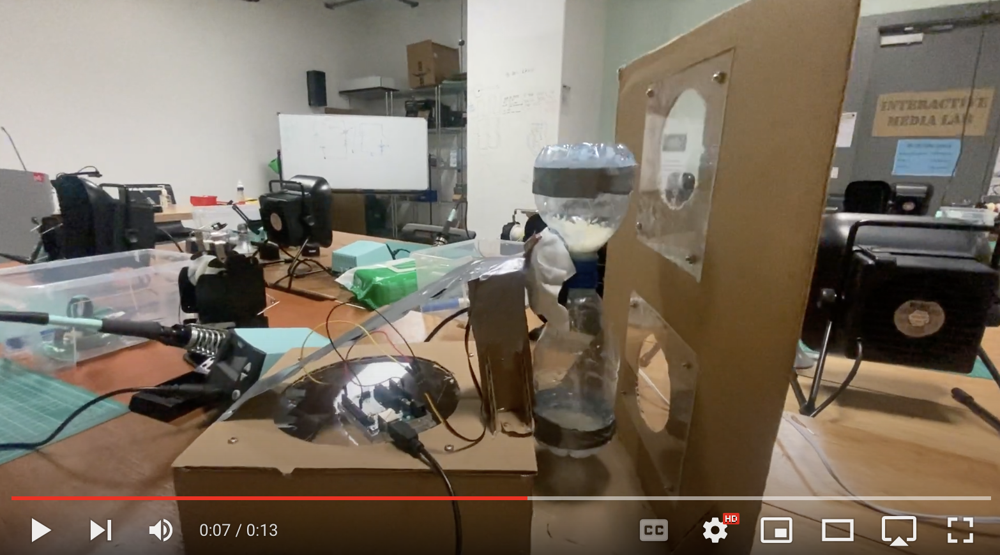

# Sand Clock Prototype
The objective of this assignment was to make a prototype of the mechanism that I have identified as the most difficult.

### Sand Clock Rotation Mechanism
[Final Product Mockup]

For the prototype, I decided to create a sand-clock that rotates 180 degrees at regular intervals. Here are some of the goals I had in mind while building this machine:

1. Design a box with transparent windows that displays falling sand to achieve the desired visual effect.
2. Build a sand-clock that can rotate and allow sand to fall from one side to the other.
3. Attach a motor and use Arduino to automate the clock's rotation periodically.

### Final Prototype Video Demo

https://youtu.be/7aoLej9mUvs

### Progress 

### Choosing right motor 

### Choosing the material that can act as "Sand"
