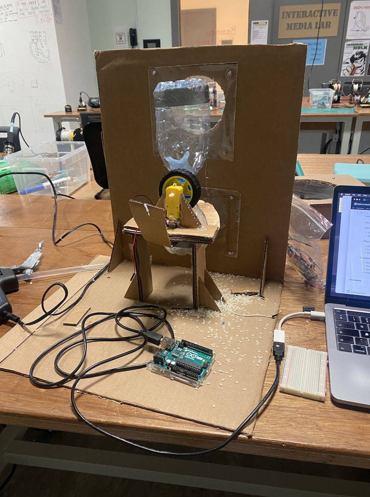

# Sand Clock Prototype
The objective of this assignment was to make a prototype of the mechanism that I have identified as the most difficult.

### Sand Clock Rotation Mechanism
[Final Product Mockup]

For the prototype, I decided to create a sand-clock that rotates 180 degrees at regular intervals. Here are some of the goals I had in mind while building this machine:

1. Design a box with transparent windows that displays falling sand to achieve the desired visual effect.
2. Build a sand-clock that can rotate and allow sand to fall from one side to the other.
3. Attach a motor and use Arduino to automate the clock's rotation periodically.

### Final Prototype Video Demo

https://youtu.be/7aoLej9mUvs

### Progress 1 | Building Structure

I created the basic structure of a sand clock using acrylic board, a plastic bottle, cardboard boxes, and a DC motor. Though the bottle is currently empty, if colored sand were inside, viewers could watch it fill up through a window. For the final project, I plan to make only one hole so that either the bottom bottle, where the sand gets filled, or the top, where the sand is being disposed, is visible. Each hole will have a sand clock bottle working.

### Choosing the material that can act as "Sand"

When plastic bottles are cut open and attached at the neck and bottom, there are still gaps between them. Using sand to prototype this wasn't ideal because the sand would leak everywhere. I needed to find a material that could carry sand effectively but had granules large enough so that they wouldn't penetrate through the unsealed spaces. Therefore, I chose rice. However, during the experiment, the plastic bottle that was attached via hot glue eventually broke and made a mess.

Making the right size of hole between the two bottles, where the rice can pass through, was difficult because if the hole is too small, the rice would get stuck and not go through, while if the hole is too big, it wouldn't have the effect of gradually filling up the sand (rice) over time, which is the essence of a sand clock. Through several iterations, I found the perfect sweet spot that would flush rice at the desired speed.

### Choosing the right motor

https://www.youtube.com/shorts/GYxhElcZuuM

Initially, I created a prototype using a DC motor. However, during a help session with Professor Michael Shiloh, I learned that a DC motor is not ideal for the desired mechanism because it does not track the degree of rotation. Instead, a servo motor would allow me to track and specify the degree of rotation. Since the motor does not have to turn 360 degrees, the fact that it has to rotate 180 degrees and return back to 0 degree was not an issue for me.

