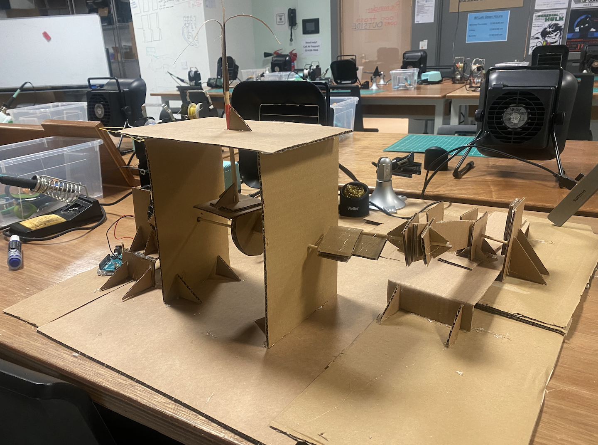

## Building Hand-crank mechanism
The objective of this assignment was to build a hand-crank mechanism with at least one cam, one crank, and a slider mechanism.
### Final Video
Click image below to watch the video.

