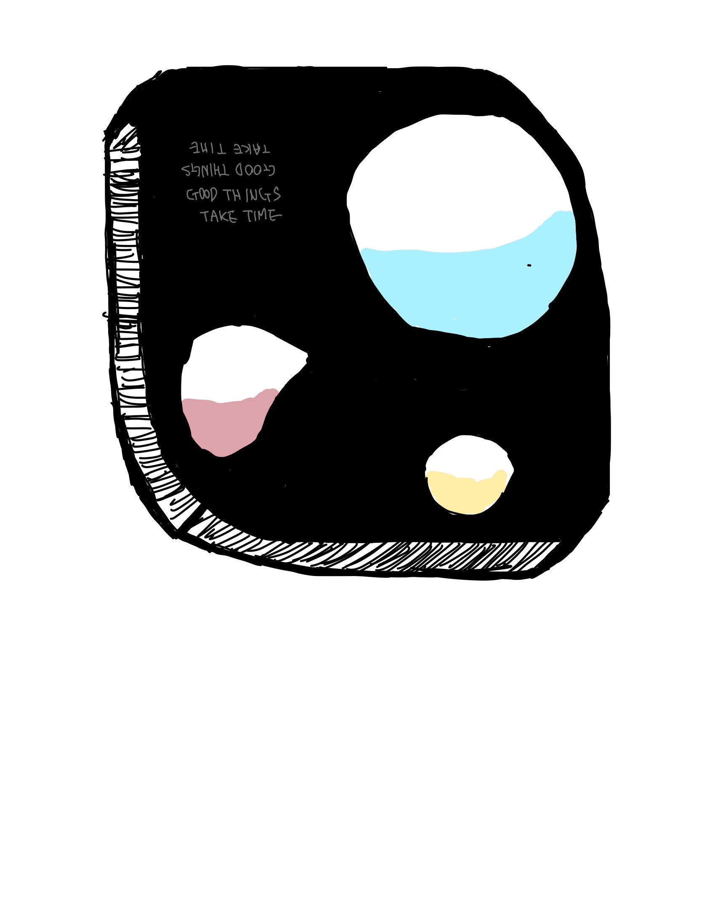
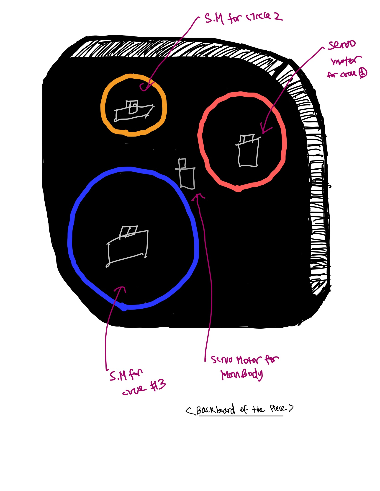

# Imaginary Mechanism for Clock
The objective of this assignment was to design the portion of the clock based on the theme "The UAE".

### Sand Art Clock
[Final Product Mockup]

[Final Product Rotated]

[Final Product from behind]

### Resources & Linkes
[Sand falling aesthetic inspiration]
https://youtube.com/shorts/JjmKS9F7B0M?feature=share

[Servo-motor rotation mechanic]
https://youtu.be/iQVR9BI517I

[Application & Materials]
https://www.youtube.com/watch?v=lep6wm2yv-Y

