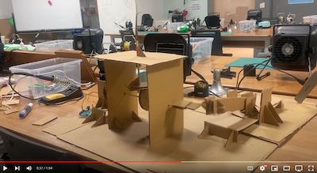
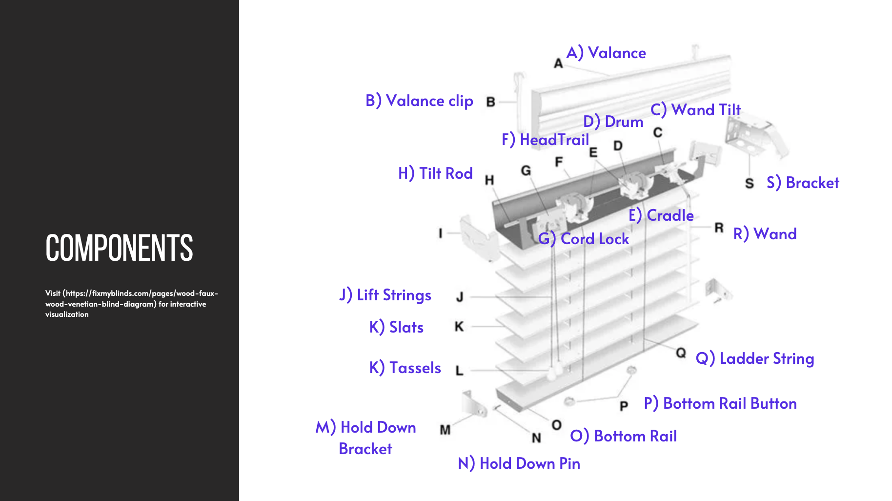
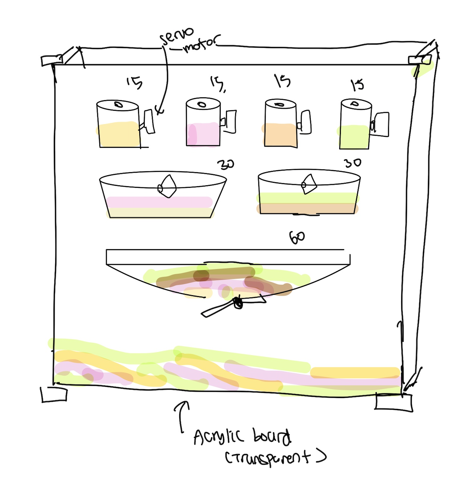

# machineLab
This is a documentation repository for a class machineLab taught by professor Michael Shiloh.

### [Building Hand-crank mechanism | Febuary 6, 2023 ](https://github.com/Soojin-Lee0819/machineLab/tree/main/6February)

### [Window Blind Mechanism Presentation | Febuary 15, 2023 ](https://github.com/Soojin-Lee0819/machineLab/tree/main/6February)

### [Sand Art Clock Idea | Febuary 20, 2023 ](https://github.com/Soojin-Lee0819/machineLab/tree/main/20February)

