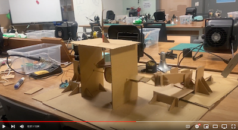

## Building Hand-crank mechanism
The objective of this assignment was to build a hand-crank mechanism with at least one cam, one crank, and a slider mechanism.

### Final Video

### Challenge 1
The follower, the surface of the cam that pushes the rod, was too small. As a result, when the motor was running, the follower would become dislodged from the cam after a few seconds. To address this issue, I added an extra layer of cardboard with a larger surface area. This ensured that the follower remained within the boundary, even if it went off-grid.

### Challenge 2
Origially, I made a mistake of building a slider support beneath the connecting rod. This was because I didn't fully understand the function of slider mechanism. 

Later, after when I have built the slider and connected the motor, I was able to fully understand the purpose of this structure that lifts slider up. Ideally this would be a plaster that minimizes the friction, but cardboard worked as well. When I tried without the elevation, sliding directly on the ground, it worked as well but it was less stable. 

### Findings & Future Steps
- I am amazed by the sturdiness of the triangle!
- I want to program a code that controls the speed of the motor 
